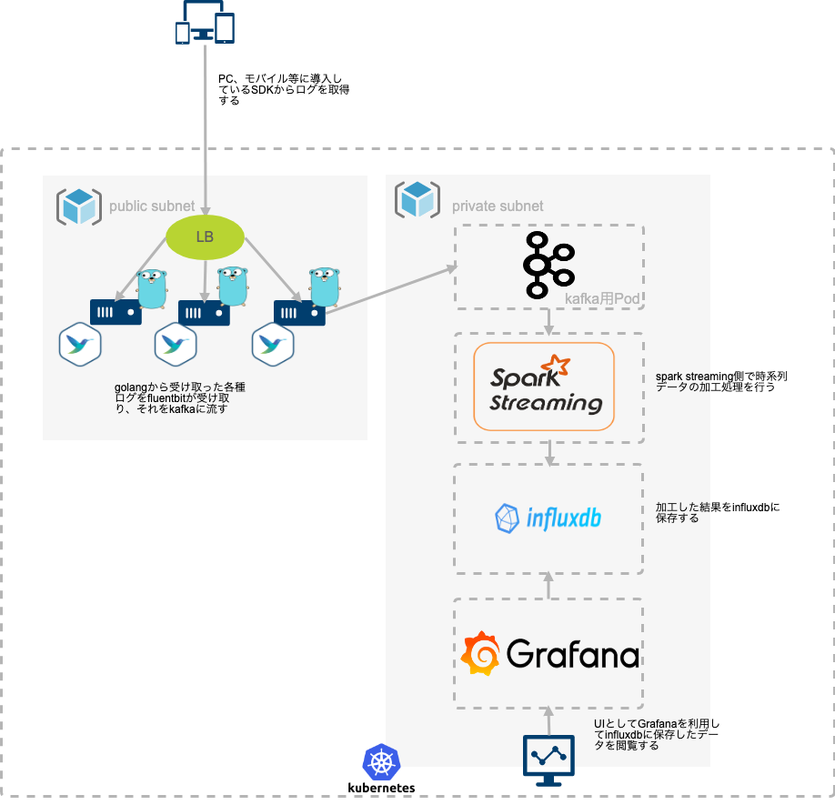

# software-engineer-challenge-java
[](https://circleci.com/gh/miseyu/software-engineer-challenge-java/tree/master)

## Directory structure
```
├── src
│   ├── main
│   │   ├── java
│   │   │   └── software
│   │   │       └── engineer
│   │   │           └── challenge
│   │   │               ├── ImmutableQueue.java
│   │   │               └── Queue.java
│   │   └── resources
│   └── test
│       ├── java
│       │   └── software
│       │       └── engineer
│       │           └── challenge
│       │               └── ImmutableQueueSpecTest.java
│       └── resources
```

# Pls architecture

